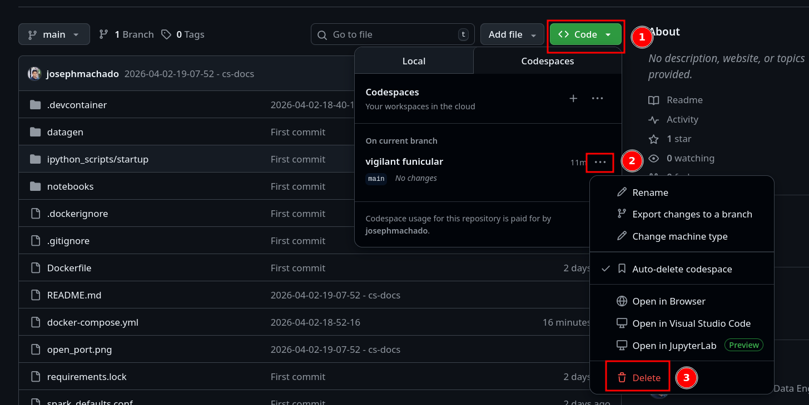

# Sample of Data Engineering Course: Idempotency 

Sample Code for Startdataengineering's **Data Engineering Course**.

[](https://codespaces.new/josephmachado/data-engineering-course-sample)

In GitHub Codespaces wait a few minutes, the `docker compose up -d --build` command will run automatically.

After which wait another 2 minutes and then click on the `ports` tab and the `world` icon next to link with port 8888 to open jupyterlab in your browser.


Once you are done delete the codespace instance as shown below.



## Local Setup 

**Prerequistites**

1. [git](https://git-scm.com/book/en/v2/Getting-Started-Installing-Git)
2. [Docker](https://docs.docker.com/engine/install/) and [Docker Compose](https://docs.docker.com/compose/install/)

**Windows users**: Please use WSL and Install Ubuntu using this [document](https://documentation.ubuntu.com/wsl/stable/howto/install-ubuntu-wsl2/#). In your ubuntu terminal install the prerequisites above.

Start the containers with 

```bash 
docker compose up -d --build
sleep 30 # sleep 30 seconds to wait for the container and its services to fully start

```

Start the course by opening Jupyter Lab at [http://localhost:8888/](http://localhost:8888/)

Open Airflow UI at [http://localhost:8080/](http://localhost:8080/) 

## Spin Down

Once you are done, stop the containers with the following command.

```bash
docker compose down -v
```
